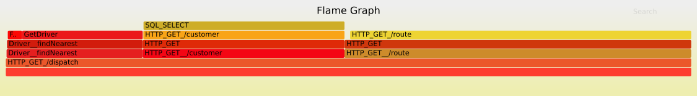

[](https://travis-ci.org/symbiont-io/jaeger-flamegraph)

Visualise [Jaeger](https://www.jaegertracing.io/) tracing data as a [flamegraph](http://www.brendangregg.com/flamegraphs.html).

For example, the [HotROD](https://github.com/jaegertracing/jaeger/tree/master/examples/hotrod) demo can be visualised as

```
curl "http://localhost:16686/api/traces?service=frontend" | \
  jaeger-flamegraph | \
  flamegraph.pl > frontend.svg
```



To install, use the `cabal-install` tool (get it from [`ghcup`](https://github.com/haskell/ghcup) or your operating system's package manager) and type

```
cabal new-update
cabal new-install jaeger-flamegraph
```

There is no need to clone this repository.

Further documentation in `jaeger-flamegraph.cabal` or with the `--help`.
